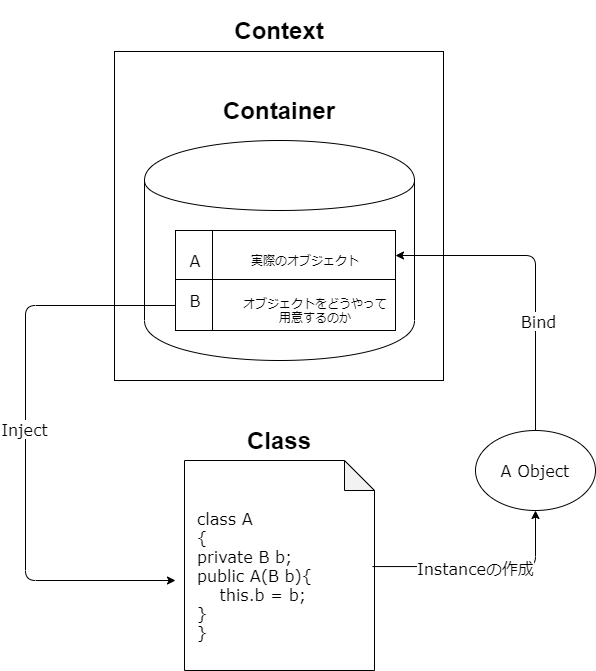

ZenjectTest.cs
==

## 「[Zenject チョットワカル Book](https://booth.pm/ja/items/1520608)」を読む

### DependencyInjection

- ZenjectのDI以外の機能
  - MonoBehaviour を継承せず Update を行う機能
  - Pub/Sub メッセージング機構
    - メッセージを送るための通信のパターン
    - 送る側はトピックにメッセージを送り、受け取る側はトピックを購読してトピックに送られてきたメッセージ飲みを受け取る
      - トピック≒Rx.Subjectみたいな
  - オブジェクトプール機構
- Extenject
  - ZenjectのFork
  - 今やこっちの方がメンテナンスされている

### Getting Started Zenject

- ZenjectによるDIでは二つのものが必要
  - 依存関係を保持するDiConstainer
  - DiConstainerを用いてInjectを行うContext
- DiContainer
  - DIコンテナに情報を登録することをBindと呼ぶ
    - Bindするための方法は二つ
      - Zenject bindingをアタッチする
      - Installerにコードを書く
  - バインドしたオブジェクトを必要としているオブジェクトに渡すことをInjectと呼ぶ
    - `[Inject]`
      - 自動的に探されてInjectされる
- Context
  - DIコンテナを使ってInjectするやつ
  - SceneContextはSceneに一つのコンテキスト
- Injectの種類
  - フィールドインジェクション
  - メソッドインジェクション（公式推奨）
  - プロパティインジェクション
  - コンストラクタインジェクション（公式推奨）
    - 循環参照でエラーを出してくれる

### Installer を用いた DI

- Bindの書き方

```
Container.Bind<ContractType>() // Bind する型の定義
    .WithId(Identifier) // 固有 ID を設定して識別する
    .To<ResultType>() // 実際に渡されるインスタンスの型
    .FromConstructionMethod() // インスタンスをどのように生成す
    るか
    .AsScope() // インスタンスを都度作るか、使いま
    28
    3.2 Bind の書き方
    わすか
    .WithArguments(Arguments) // インスタンス生成時に渡す初期値
    .OnInstantiated(InstantiatedCallback) // 生成時のコールバック
    .When(Condition) // Inject 対象を絞るフィルタ
    .(Copy|Move)Into(All|Direct)SubContainers() // SubContainer での扱い (ほぼ使う
    ことない)
    .NonLazy() // 遅延させず即時に生成する
    .IfNotBound(); // 二重に Bind させない
```

- Bindするインスタンス
  - AsTransient()：Injectされるたびにインスタンスが作られる
  - AsCached()：一つのBindに対して同じインスタンスがInjectされる
  - AsSingle()：一つのDIコンテナの中で同じインスタンスがInjectされる
- `NonLazy()`
  - Inject先がなくても、Bindされたオブジェクト用意する
- Installerの種類
  - MonoInstaller：MonoBehaviorを継承したインスペクタ上でパラメータを渡せるInstaller
  - Installer：static methodでDIコンテナを渡せばバインドしてくれるInstaller
  - ScriptableObjectInstaller：シーンに依らずインスペクタでパラメータの渡せるInstaller
  - PrefabInstaller：MonoInstallerがアタッチされたPrefab

### 様々な Bind たち

- `FromResolveGetter<T>(Func<T, T2> getter)`は集約に使えそう
- WithArguments
  - 基本的には全部Bindすればよい
  - 依存関係が単純なときに使う
- 配列の扱いが難しい

### 動的な Binding

- 動的な
- PlaceholderFactoryを介してインスタンスを生成する
  - 生成処理は自動で定義されるか、
  - Ifactoryを実装したファクトリクラスに委譲できる
- ファクトリクラスはクラス内クラスとして定義することを推奨している
- 初期化時以外にオブジェクトの生成を行うなら、オブジェクトの生成のためのファクトリをDIせよ

### シーンを跨ぐ DI

- ZenjectSceneLoader
  - SceneManagerとだいたい同じ
  - 第三引数にInstallerみたいにBindが書ける
  - SceneContextに自動で追加される
- SceneContext以外のContext
  - ProjectContext
    - Resourceフォルダに入れる必要がある
  - ParentContract
    - マルチシーンで親子関係があるなら便利
    - 文字列で名前を付けて関係をInspector上で記述する
  - SceneDecoratorContext
    - デコレーターパターン
    - デコレートされるSceneのDIコンテナに追加でBindしていく
  - ZenjectSceneLoader.LoadSceneRelationshipでシーン遷移時に親子関係を作ることもできる
  - ProjectContextは最終手段

## 参考文献まとめ

- チートシート（英語）：https://github.com/modesttree/Zenject/blob/master/Documentation/CheatSheet.md
- ドキュメント的なもの（英語）：https://github.com/modesttree/Zenject#table-of-contents
- MultiSceneSetup.cs：https://gist.github.com/svermeulen/8927b29b2bfab4e84c950b6788b0c677

## 「[Zenjectを使うときに気を付けていること](https://adarapata.hatenablog.com/entry/unity-advent-calendar-2019)」を読む

- Validate
  - Shift+Alt+vでシーン内の依存関係をチェックしてくれる
- ContainerのInstaller以外での使い道
  - ファクトリに持たせることでVlidationに巻き込む
  - IVaridatableで`Validate()`を実装
    - 実際には生成されないDry-run
- SubContainer
  - 同じコンテキストの中で子コンテナとして別のDIコンテナを作る
  - FromSubContainerResolveでBindをサブコンテナに委譲
  - サブコンテナはメソッドやインストーラーから作れる
  - BindするものがMonoBehaviorの場合、PrefabにGameObjectContextをアタッチする
    - `ByNewContextPrefab()`
- IInitializable
  - Initialize()を、オブジェクト構築後に適切に呼び出してくれる
  - UnityのStartのタイミング
  - 複雑な初期化ロジックを含めることを想定
- Decorator Binding
  - `Container.Decorate<ContractType>().With<DecorateType>()`で、もともとBindされるオブジェクトにDecorateTypeで装飾したものをInjectする
- Decorator Context
  - メインとなるSceneのBindを使ってデバッグ用の処理が追加出来る
  - マルチシーンのロード順に注意

## 公式ドキュメントを読む

- ITickable
  - Update毎に呼ばれる処理を登録できる
    - ITickableを継承してTick()を実装する
    - InstallerでITickableにBindする
  - IFixedTickableやILateTickableもあるよ
  - BindExecutionOrderで順番をつけることもできるよ

## デモを作る

### デモで見せたいポイント

- シーンを跨ぐデータのやり取り
- **SceneContextに登録するInstallerを変えて挙動を変える**
- テストの書き方を示す

### デモでやりたいポイント

- デコレートシーンでのデバッグ
- Factoryによる動的生成

### デモ案

- 単純な3Dアクションゲーム
- 組み立てて行く感じのゲームシステムが良い？
- ブロック崩し？

## 概念図を描く



## 何がうれしいのか

### 嬉しかったこと

- 繋げることは考えずに、それぞれの部分を実装できるので非常に頭が楽
  - オブジェクト指向してる感じ
- Validateで依存関係がすぐにテストできる
- デバッグ用の実装・置き換えが一瞬で終わった
- IInitializeは便利（だけど不要な依存性を生んでる気もする）

### 客観的に嬉しいこと

- DIコンテナの親子関係で、依存関係を整理
- UnityのSceneとの親和性
  - マルチシーンでのやりとり
  - シーン遷移時のデータのやり取り

```
・巨大なプログラムがある
・それをコンポーネントに切り分けていく。けれど替えがきかない。
・インターフェイスを挟む。替えはきくが、内部を変更する必要がある。
・依存性を注入する。その代りオブジェクト生成が複雑になり、その生成ロジックが分散している。
・あらかじめ登録しておいた生成ルールを使い、DIコンテナにオブジェクトを生成させる
```

### 嬉しくなかったこと

- コンパイルエラーが出ない
  - 実行してみないと動くか分からない面がある
  - 特に動的生成周り
- やっぱりMonobehaviorとの食い合わせは悪い

### 客観的に嬉しくないこと

- リフレクション使ってるから過度な使用でのパフォーマンスが心配
- DIコンテナが複雑になりすぎる
- Zenjectなしでは生きられなくなる

### 総評

**個人でのUnity開発でZenjectを使わないことは今後一切ないだろうと言い切れる**
